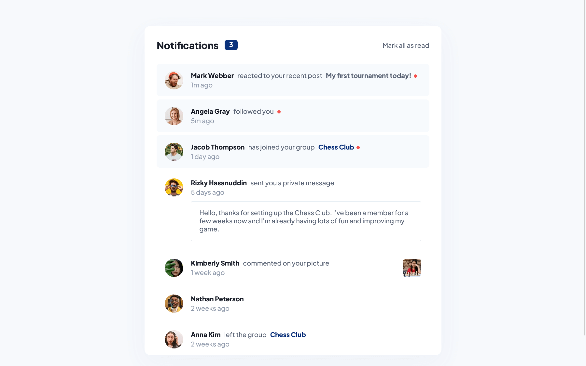
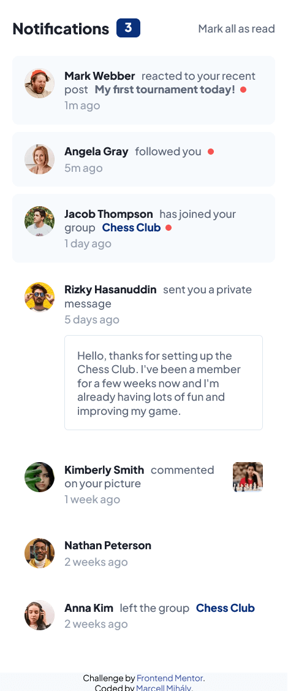

# Frontend Mentor - Notifications page solution

This is a solution to the [Notifications page challenge on Frontend Mentor](https://www.frontendmentor.io/challenges/notifications-page-DqK5QAmKbC). Frontend Mentor challenges help you improve your coding skills by building realistic projects.

## Table of contents

- [Overview](#overview)
  - [The challenge](#the-challenge)
  - [Screenshots](#screenshots)
  - [Links](#links)
- [My process](#my-process)
  - [Built with](#built-with)
- [Author](#author)

## Overview

### The challenge

Users should be able to:

- Distinguish between "unread" and "read" notifications
- Select "Mark all as read" to toggle the visual state of the unread notifications and set the number of unread messages to zero
- View the optimal layout for the interface depending on their device's screen size
- See hover and focus states for all interactive elements on the page

### Screenshots

Desktop

---

Mobile

### Links

- Solution URL: [https://github.com/mihalymarcell86/notifications-page](https://github.com/mihalymarcell86/notifications-page)
- Live Site URL: [https://notifications-page-six.vercel.app/](https://notifications-page-six.vercel.app/)

## My process

This time, I decided to extract the data from the given HTML file, and store it in a JavaScript object instead, because it made it easier to handle the states, and the code turned out to be cleaner overall.

### Built with

- Semantic HTML5 markup
- Sass, CSS Modules
- Mobile-first workflow
- [React](https://reactjs.org/) - JS library

## Author

- GiThub - [@mihalymarcell86](https://www.github.com/mihalymarcell86)
- Frontend Mentor - [@mihalymarcell86](https://www.frontendmentor.io/profile/mihalymarcell86)
